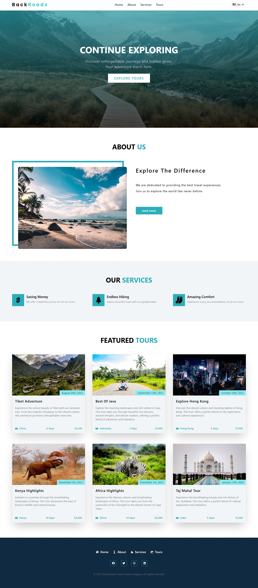

# Back Roads Landing Page

---

[](https://backroads-landing-page-sigma.vercel.app/)

## Overview

A landing page for Back Roads travel company built with React and Tailwind CSS. It supports multiple languages including Arabic, English, and Spanish. The design is modern and clean, with a focus on user experience.

## Features

- Translation support (Arabic, English and Spanish)
- Modern and clean design
- Responsive design
- Smooth scrolling
- Interactive elements
- Tailwind CSS for styling
- React for building UI components
- React Icons for icons

## Installation

1. Clone the repository
2. Install dependencies
   ```bash
   npm install
   ```
3. Start the development server
   ```bash
   npm run dev
   ```
4. Open your browser and navigate to `http://localhost:3000`

## Technologies Used

- React
- Tailwind CSS
- React Icons
- Vite

## Author

**Eng. Abdelaziz Mohamed**

- [LinkedIn](https://www.linkedin.com/in/abdelaziz)
- [GitHub](https://github.com/Abdelaziz-Mohammed)
